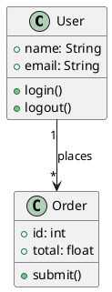
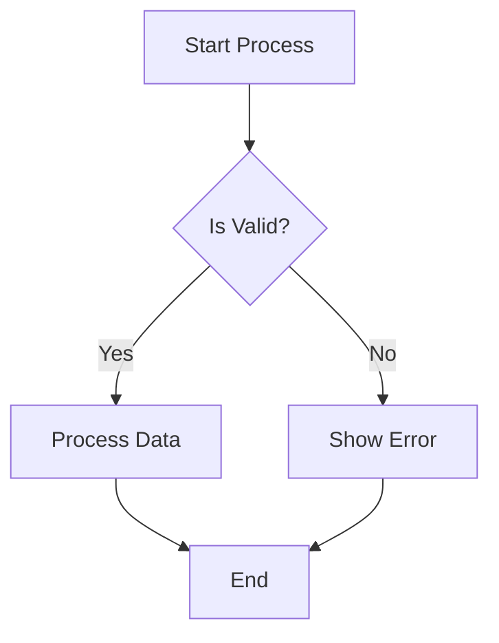
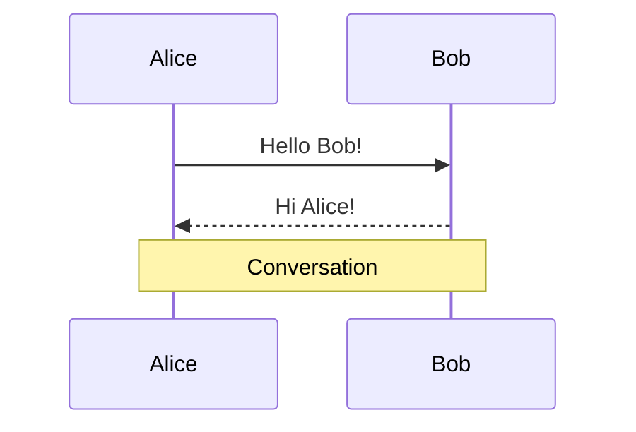

# gDiagram

A native GTK4/libadwaita diagram viewer and editor supporting PlantUML, Mermaid, and more.


## Features

- **Native rendering** using Graphviz (no Java required)
- **Real-time preview** with debounced updates as you type
- **Multiple diagram formats**:
  - **PlantUML** - Full support for all diagram types
  - **Mermaid** - Flowchart and Sequence diagrams (✅ COMPLETE!)
- **Syntax highlighting** for both PlantUML and Mermaid
- **PlantUML diagram types**:
  - Sequence diagrams
  - Class diagrams
  - Activity diagrams
  - State diagrams (with stereotypes, history states)
  - Use Case diagrams (with system boundaries)
  - Component diagrams (with ports)
  - Object, Deployment, ER, MindMap diagrams
- **Mermaid diagram types**:
  - ✅ **Flowcharts** - All node shapes, arrows, subgraphs, styling
  - ✅ **Sequence diagrams** - Actors, messages, notes, loops, autonumbering
  - 🔜 State diagrams (planned)
- **Export** to SVG, PNG, and PDF
- **Auto-format detection** - Recognizes .puml, .mmd file extensions
- **Dark mode** support
- **Multi-tab** editing

## Installation

### From Package (Recommended)

Download the latest release from the [Releases](https://github.com/packerlschupfer/gDiagram/releases) page:

- **Debian/Ubuntu**: Download `.deb` file and install with `sudo dpkg -i gdiagram_*.deb`
- **AppImage**: Download, make executable (`chmod +x`), and run
- **Flatpak**: `flatpak install gdiagram.flatpak`

### Building from Source

#### Dependencies

**Debian/Ubuntu:**
```bash
sudo apt install meson ninja-build valac \
  libgtk-4-dev libadwaita-1-dev libgtksourceview-5-dev \
  libgee-0.8-dev libgraphviz-dev librsvg2-dev libcairo2-dev \
  gettext graphviz
```

**Fedora:**
```bash
sudo dnf install meson ninja-build vala \
  gtk4-devel libadwaita-devel gtksourceview5-devel \
  libgee-devel graphviz-devel librsvg2-devel cairo-devel \
  gettext graphviz
```

**Arch Linux:**
```bash
sudo pacman -S meson ninja vala \
  gtk4 libadwaita gtksourceview5 \
  libgee graphviz librsvg cairo \
  gettext
```

#### Build & Install

```bash
meson setup build --prefix=/usr
meson compile -C build
sudo meson install -C build
```

#### Run without installing

```bash
./build/src/gdiagram
```

## Usage

```bash
# Open empty editor
gdiagram

# Open a PlantUML file
gdiagram diagram.puml

# Open a Mermaid file (coming soon)
gdiagram diagram.mmd
```

### Example Diagrams

#### PlantUML Class Diagram



#### Mermaid Flowchart



#### Mermaid Sequence Diagram



See more examples in the [`examples/`](examples/) directory.

## Building Packages

### Debian Package
```bash
dpkg-buildpackage -us -uc -b
```

### Flatpak
```bash
flatpak-builder --user --install build-flatpak org.gnome.gDiagram.json
```

### AppImage
```bash
cd appimage
appimage-builder --recipe AppImageBuilder.yml
```

## Contributing

Contributions are welcome! Please feel free to submit a Pull Request.

## License

This project is licensed under the GNU General Public License v3.0 - see the [LICENSE](LICENSE) file for details.

## Acknowledgments

- [PlantUML](https://plantuml.com/) for the diagram syntax
- [Graphviz](https://graphviz.org/) for diagram rendering
- [GTK](https://gtk.org/) and [libadwaita](https://gnome.pages.gitlab.gnome.org/libadwaita/) for the UI framework
