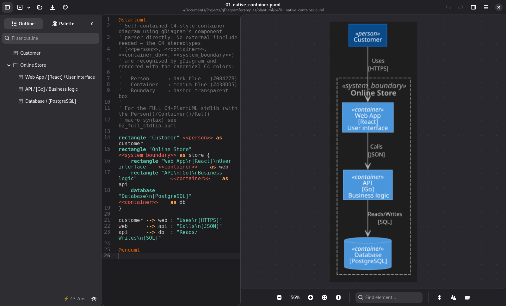
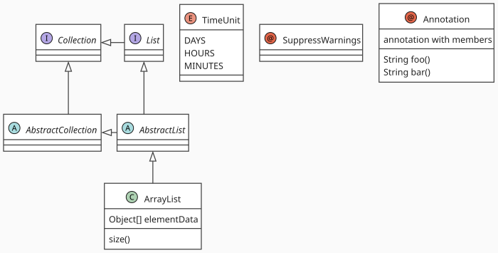
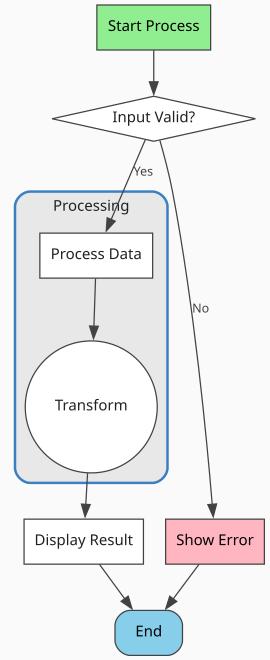
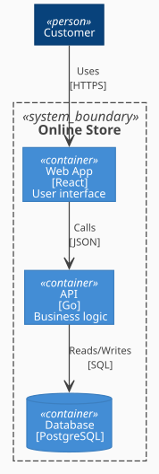
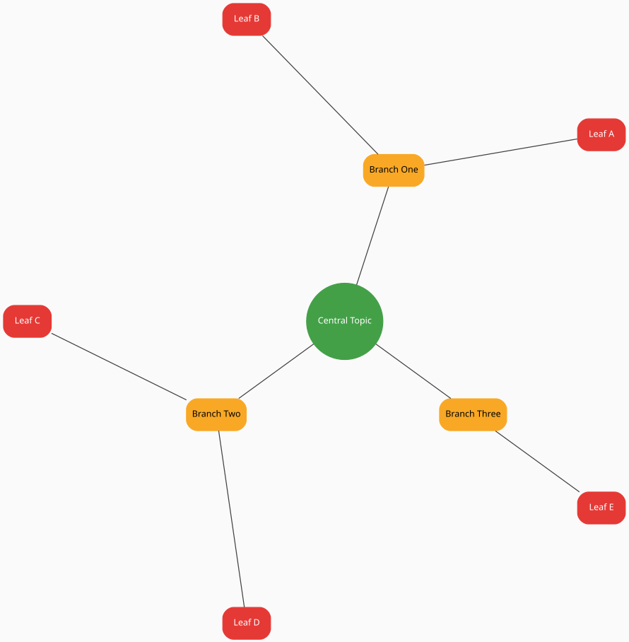

# gDiagram

A native GTK4/libadwaita diagram viewer and editor supporting PlantUML and Mermaid syntax, with real-time preview and no Java or Node.js required.



## Features

- **Native rendering** — Graphviz-based, no Java, no Node.js, no browser
- **Real-time preview** — debounced live update as you type
- **Syntax highlighting** — for both PlantUML and Mermaid
- **Multi-tab editing** with auto-close of untouched tabs
- **Export** to SVG, PNG, and PDF — interactive dialog or headless CLI (`--export`)
- **Auto-format detection** — from file extension (`.puml`, `.mmd`) and content keywords
- **Dark mode** — follows system theme, per-diagram dark toggle, 7 color presets with per-slot overrides
- **Click-to-source** — click a rendered element to jump to its source line
- **Outline panel** — navigable list of diagram elements with click-to-source
- **Zoom & pan** — mousewheel zoom-to-cursor, pinch-to-zoom, drag to pan, minimap for large diagrams
- **Template gallery** (`Ctrl+T`) — built-in templates for all diagram types
- **Diagram tools** — stats, linting, validation, complexity analysis, optimization suggestions, beautifier
- **Diagram comparison** — semantic diff between diagrams or file versions
- **Git integration** — blame gutter, diff marks, history viewer, repo graph
- **Performance monitor** — render time display in status bar
- **VS Code extension** — full-featured extension with live preview, syntax highlighting, snippets, completions, hover info, and outline symbols via built-in LSP server

| | |
|---|---|
|  |  |
|  |  |

---

## Diagram Types

### PlantUML (26 types)

| Type | Notes |
|------|-------|
| Sequence | Participants, messages, notes, groups, lifelines, autonumber |
| Class | Members, relations, visibility, generics, packages, stereotypes |
| Activity | Branches, loops, swimlanes, concurrency, notes, detach |
| State | Composite states, history, fork/join, concurrency, stereotypes |
| Use Case | Actors, system boundaries, extends/includes |
| Component | Interfaces, ports, containers, nesting |
| Object | Instances, maps, links |
| Deployment | Nodes, artifacts, clouds, nesting |
| ER | Entities, relationships, crow's foot notation |
| MindMap | Hierarchical tree, arithmetic notation |
| WBS | Work breakdown structure |
| Gantt | Tasks, sections, milestones, dependencies, critical path |
| JSON | Data tree visualization with syntax highlighting |
| YAML | Data tree visualization with indentation-based nesting |
| Chronology | Vertical timeline of events with dates |
| Timing | Signal state timelines (concise, robust, binary, clock, analog) |
| Network (nwdiag) | Network segments, nodes, addresses, groups |
| Archimate | Business, Application, Technology, Motivation, Physical layers |
| **C4** | Context, Container, Component diagrams via stereotypes. Both native and full [C4-PlantUML](https://github.com/plantuml-stdlib/C4-PlantUML) macro syntax. |
| DOT passthrough | Raw Graphviz DOT — `@startdot` / `@enddot` |
| Salt (wireframes) | UI mockups with buttons, text fields, checkboxes, dropdowns |
| Chen ER | Chen notation with entities (boxes), relationships (diamonds), attributes (ovals) |
| EBNF | Grammar railroad diagrams from EBNF rules |
| Regex | Regular expression NFA/railroad visualization |
| Tree | Indentation-based tree diagrams |
| Ditaa | ASCII art rendered as monospace diagram |
| Board | Kanban-style board with columns and cards |

#### PlantUML preprocessor

gDiagram includes a near-complete PlantUML preprocessor implementation:

- `!include "local.puml"` — local file inclusion with circular-include detection
- `!define NAME VALUE` and `!define BOX(args) body` — simple and parameterized macros
- `!procedure` / `!unquoted procedure` / `!function` / `!return` / `!endprocedure` — multi-line macros and functions
- `!ifdef` / `!ifndef` / `!if EXPR` / `!elseif` / `!else` / `!endif` — conditional compilation
- `!$var = expr` and `!$var ?= expr` — variable assignment
- Default parameter values: `!unquoted procedure Foo($a, $b="default")`
- Expression evaluator: arithmetic, comparisons, `&&` / `||` / `!`, string concatenation, function calls
- 19 built-in functions: `%substr`, `%strpos`, `%strlen`, `%upper`, `%lower`, `%function_exists`, `%is_dark`, `%intval`, `%set_variable_value`, `%get_variable_value`, and more

This is enough to expand the full [C4-PlantUML](https://github.com/plantuml-stdlib/C4-PlantUML) standard library at parse time.

### Mermaid (24 types — complete coverage)

| Type | Notes |
|------|-------|
| Flowchart | 11 shapes, 6 arrow types, subgraphs, classDef styling, click handlers |
| Sequence | Actors, messages, notes, loops, autonumber, parallel blocks, activation bars |
| State | States, transitions, start/end, nested states, fork/join concurrency |
| Class | Classes, members, relationships, visibility, generics, annotations |
| ER | Entities, attributes, relationships, cardinality, PK/FK/UK keys |
| Gantt | Tasks, sections, milestones, critical path, dependencies |
| Pie | Data slices, percentages, showData option |
| Git Graph | Branches, commits, merges, tags, commit types |
| User Journey | Tasks, satisfaction scores, sections, multiple actors |
| Mindmap | Hierarchical tree, multiple node shapes, depth-colored nodes |
| Timeline | Chronological events with sections |
| Quadrant | 2×2 quadrant chart with labeled points |
| XYChart | Bar and line charts with axes |
| Kanban | Kanban board with columns and cards |
| Sankey | Flow/energy diagrams with proportional links |
| Requirement | Requirement elements with relationships |
| Block | Grid-layout blocks, groups, directional arrows |
| Packet | Network packet structure, bit-range fields, 32-bit row layout |
| C4 | Context, Container, Component, Dynamic, Deployment diagrams |
| Architecture | Infrastructure topology with services, groups, junctions |
| ZenUML | Code-style sequence diagrams with nested calls |
| Radar | Spider/polar charts for multi-dimensional comparison |
| Treemap | Hierarchical tree with value-proportional leaf sizing |

---

## Git Integration

- **Blame gutter** — inline `git blame` per line, click for full commit detail
- **Diff marks** — line gutter marks for added/changed/removed lines vs HEAD
- **History viewer** (`Ctrl+Shift+H`) — commit log for the current file, side-by-side compare, restore to editor, open in Meld
- **Repo graph** (`Ctrl+Shift+G`) — live Mermaid gitGraph of the repository with branch filtering and commit detail panel

---

## Installation

### From Package

Download the latest release from the [Releases](https://github.com/packerlschupfer/gDiagram/releases) page.

```bash
# Debian/Ubuntu
sudo dpkg -i gdiagram_*.deb
```

### Building from Source

#### Dependencies

**Debian/Ubuntu:**
```bash
sudo apt install meson ninja-build valac \
  libgtk-4-dev libadwaita-1-dev libgtksourceview-5-dev \
  libgee-0.8-dev libgraphviz-dev librsvg2-dev libcairo2-dev \
  libsoup-3.0-dev libjson-glib-dev \
  gettext graphviz
```

**Fedora:**
```bash
sudo dnf install meson ninja-build vala \
  gtk4-devel libadwaita-devel gtksourceview5-devel \
  libgee-devel graphviz-devel librsvg2-devel cairo-devel \
  libsoup3-devel json-glib-devel gettext graphviz
```

**Arch Linux:**
```bash
sudo pacman -S meson ninja vala gtk4 libadwaita gtksourceview5 \
  libgee graphviz librsvg cairo libsoup3 json-glib gettext
```

> **Note:** gDiagram requires a patched Graphviz build for correct HTML table cell text centering in activity diagrams. See `patches/` and `scripts/build-patched-graphviz.sh`.

#### Build & Install

```bash
meson setup build --prefix=/usr
meson compile -C build
sudo meson install -C build
```

#### Run without installing

```bash
./build/src/gdiagram
```

---

## Usage

```bash
gdiagram                  # open empty editor
gdiagram diagram.puml     # open a PlantUML file
gdiagram diagram.mmd      # open a Mermaid file

# Headless export (no GUI required)
gdiagram -e output.png diagram.puml           # export to PNG
gdiagram -e output.svg -f svg diagram.mmd     # export to SVG
gdiagram -e output.pdf -f pdf diagram.puml    # export to PDF
```

### Keyboard Shortcuts

See [docs/KEYBOARD_SHORTCUTS.md](docs/KEYBOARD_SHORTCUTS.md) for the full list. Key shortcuts:

| Shortcut | Action |
|----------|--------|
| `Ctrl+S` | Save |
| `Ctrl+E` | Export (PNG/SVG/PDF) |
| `Ctrl+T` | Template gallery |
| `Ctrl+Shift+H` | Git history for current file |
| `Ctrl+Shift+G` | Git repository graph |
| `Ctrl+?` | Keyboard shortcuts overlay |

---

## VS Code Extension

gDiagram includes a VS Code extension powered by the `gdiagram-lsp` language server.

### Install

```bash
# Install the LSP server (included in the .deb package)
sudo dpkg -i gdiagram_*.deb

# Build and install the VS Code extension
cd vscode-extension
npm install && npx @vscode/vsce package
code --install-extension gdiagram-0.1.0.vsix
```

### Features

- **Live preview** (`Ctrl+Shift+V`) — side-by-side SVG rendering with zoom, pan, and click-to-source
- **Syntax highlighting** — TextMate grammars for PlantUML and Mermaid
- **Snippets** — 49 snippets covering all 50 diagram types (`puml-*` and `mmd-*` prefixes)
- **Completions** — keyword completions per diagram type
- **Hover** — documentation on hover for keywords
- **Outline** — document symbols in the outline panel
- **Export** — PNG/SVG/PDF via command palette
- **Template gallery** — "New Diagram from Template" with all 50 types
- **Diagnostics** — parse errors as VS Code Problems

---

## Examples

The [`examples/`](examples/) directory contains ready-to-open diagram files covering all supported types.

See [docs/QUICK_START.md](docs/QUICK_START.md) for a guided introduction.

---

## Architecture

Architecture diagrams (rendered by gDiagram itself) are in [`docs/architecture/`](docs/architecture/):

1. [Architecture Overview](docs/architecture/01_architecture_overview.puml) — layers, components, dependencies
2. [Rendering Pipeline](docs/architecture/02_rendering_pipeline.puml) — source → parse → render → display flow
3. [Class Hierarchy](docs/architecture/03_class_hierarchy.puml) — key class relationships
4. [Diagram Types](docs/architecture/04_diagram_types.puml) — parser/AST/renderer triples for all 50 types
5. [UI Interaction Flows](docs/architecture/05_ui_interaction.puml) — user action sequences

---

## Building Packages

### Debian Package
```bash
dpkg-buildpackage -us -uc -b
```

### Flatpak
```bash
flatpak-builder --user --install build-flatpak org.gnome.gDiagram.json
```

### AppImage
```bash
cd appimage && appimage-builder --recipe AppImageBuilder.yml
```

---

## License

GNU General Public License v3.0 — see [LICENSE](LICENSE).

## Acknowledgments

- [PlantUML](https://plantuml.com/) for the diagram syntax
- [Graphviz](https://graphviz.org/) for diagram rendering
- [GTK](https://gtk.org/) and [libadwaita](https://gnome.pages.gitlab.gnome.org/libadwaita/) for the UI framework
