# GitLab Issue — graphviz/graphviz

**Title:** HTML `<TD>` cell text not vertically centered when using pango

---

## Summary

When rendering a node with an HTML table label (`shape=plaintext`, `<TD>` cells),
the text inside each cell is not vertically centered. It appears shifted above the
visual center of the cell. The offset scales with font size and is consistently
around 3.7pt for 14pt fonts.

## Reproducer

```dot
digraph G {
  node [shape=plaintext]
  A [label=<
    <TABLE BORDER="0" CELLBORDER="1" CELLSPACING="0" CELLPADDING="6">
      <TR><TD>Hello</TD></TR>
    </TABLE>
  >]
}
```



Render with `dot -Tsvg` and inspect the cell box coordinates vs the text `y` attribute.

## Expected vs actual

For a 36pt-tall cell with 14pt Times,serif:

| | Baseline pixel y (SVG) | Centering error |
|---|---|---|
| Upstream (no fix) | 28.68pt | **+3.71pt above center** |
| This fix | 26.88pt | 0.09pt (essentially exact) |

Cell center is at SVG pixel y = 22.0pt. The logical rectangle of the text should be
centered on that point.

## Root cause

`size_html_txt()` in `lib/common/htmltable.c` computes `lfsize[0]` — the distance
from the top of the text box to the rendered baseline — as:

```c
ftxt->spans[i].lfsize = mxfsize;   // raw font size
```

`mxfsize` is the raw font size in points. It does not account for where the pango
baseline actually sits within the logical rectangle. The pango layout engine already
measures this via `pango_layout_get_baseline()` and stores it in
`span->yoffset_layout`. That value is tracked for other purposes in this same
function (`maxoffset = MAX(lp.yoffset_centerline, maxoffset)`) but is never used
for `lfsize`.

Because raw font size > actual pango ascender distance, the baseline is placed too
low, which in graphviz's y-up coordinate system means the text renders too high
within the cell.

## Fix

Track `maxlayout = MAX(span->yoffset_layout)` over all spans, then:

```c
ftxt->spans[i].lfsize = maxlayout + maxoffset;
```

where `maxoffset = MAX(span->yoffset_centerline)` (already tracked; it is a small
above-baseline renderer correction, ~0.05× font size for pango).

This places the rendered baseline at exactly the pango natural baseline position,
centering the logical rectangle in the cell. Error drops from 3.71pt to 0.09pt for
14pt Times,serif.

The non-pango fallback `estimate_textspan_size()` in `lib/common/textspan.c` sets
`span->yoffset_layout = 0.0`, which would collapse the new formula to
`lfsize ≈ 0.1 * fontsize` (far too small). The companion fix sets it to `fontsize`
as a reasonable approximation of the ascent for unknown fonts.

## Affected versions

Observed on 14.1.2. The `size_html_txt()`/`lfsize` logic has been stable for many
years; likely affects all recent versions.
