# GitLab MR — graphviz/graphviz

**Title:** Fix: Use pango font metrics for HTML `<TD>` text vertical centering

**Target branch:** `main`
**Source branch:** `fix/html-td-text-centering`

---

## What this fixes

HTML table cell text (`<TD>`) is vertically off-center. For 14pt Times,serif the
text appears ~3.7pt above the visual center of its cell. This is visible in any
`shape=plaintext` node with `CELLPADDING`. Closes #NNNN.

## Root cause

`size_html_txt()` (`lib/common/htmltable.c`) computes `lfsize[0]` — the baseline
offset from the top of the text box — as the raw font size (`mxfsize`). The pango
plugin already measures the exact baseline position within the logical rectangle via
`pango_layout_get_baseline()` and stores it in `span->yoffset_layout`, but
`size_html_txt()` never reads it back for `lfsize`.

## Changes

### `lib/common/htmltable.c`

Track `maxlayout` (max `yoffset_layout` over all spans) alongside the already-
tracked `maxoffset` (max `yoffset_centerline`), then use both for `lfsize[0]`:

```c
/* before */
ftxt->spans[i].lfsize = mxfsize;

/* after */
ftxt->spans[i].lfsize = maxlayout + maxoffset;
```

`maxlayout` = pango baseline distance from top of logical rectangle.
`maxoffset`  = small above-baseline renderer correction (~0.05× font size).
Together they place the baseline at the exact pango natural position, centering
the logical rectangle in the cell.

### `lib/common/textspan.c`

The non-pango fallback `estimate_textspan_size()` had `span->yoffset_layout = 0.0`,
which collapses the new formula to `lfsize ≈ 0`. Fix: use `fontsize` as an estimate
of the ascent for unknown fonts.

```c
/* before */
span->yoffset_layout = 0.0;

/* after */
span->yoffset_layout = fontsize;  /* estimated ascent for non-pango fallback */
```

## Measurements

Reproducer: `shape=plaintext` node, `<TD CELLPADDING="6">Hello</TD>`, 14pt
Times,serif, SVG output. Cell height = 27.24pt, cell center at SVG y = 22.0pt.

| | Centering error |
|---|---|
| Before this patch | **3.71pt** (text too high) |
| This patch | **0.09pt** (within rounding) |

## Testing

```dot
digraph G {
  node [shape=plaintext]
  A [label=<
    <TABLE BORDER="0" CELLBORDER="1" CELLSPACING="0" CELLPADDING="6">
      <TR><TD>Hello</TD></TR>
    </TABLE>
  >]
}
```



Render with `dot -Tsvg`. Compare SVG text `y` attribute against the cell polygon
bounds: with this fix the text logical rectangle is centered in the cell to within
sub-point accuracy.
